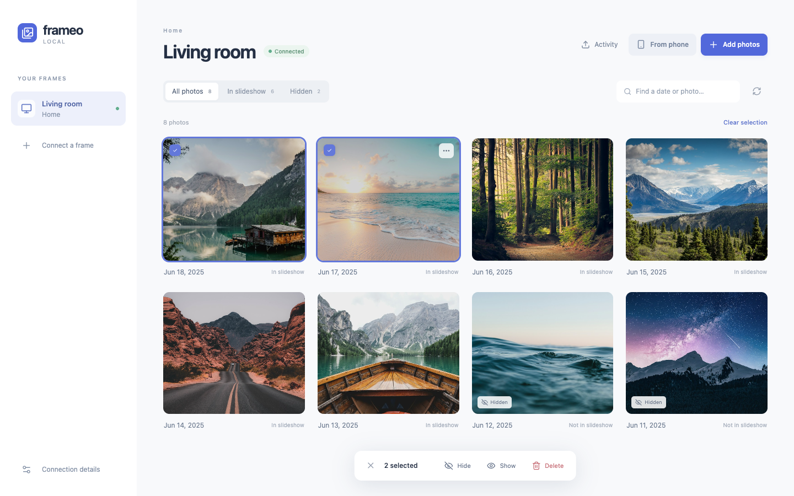
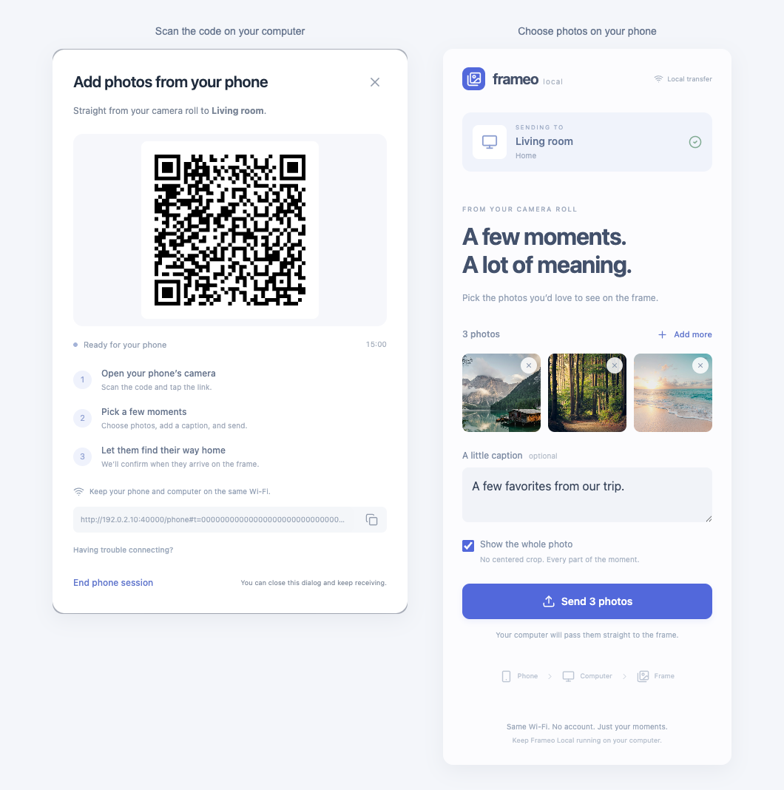

# Frameo Local

Send and manage photos on Frameo frames through your local network.

The desktop app opens an interface in your browser. Each operating system and
processor type has a separate executable. Downloaded executables do not require
Go, Node.js, Python, or an Android runtime.

Use Frameo Local to:

- Send photos from a computer or phone.
- Browse and download photos from a frame.
- Show, hide, or delete selected photos.
- Request display of a selected photo on the frame.



Screenshots use synthetic frame data and stock photos.
See [image sources and capture instructions](docs/screenshots/README.md).

## Contents

- [Requirements](#requirements)
- [Get started](#get-started)
- [Send photos](#send-photos)
- [Manage photos](#manage-photos)
- [Settings and stored data](#settings-and-stored-data)
- [Troubleshooting](#troubleshooting)
- [Developer documentation](#developer-documentation)

## Requirements

Before you start, make sure you have:

- A computer with macOS, Windows, or Linux.
- A Frameo frame on the same local network as the computer.
- Access to the frame to get a friend code and approve permissions.
- A browser that supports JPEG, PNG, or WebP images.

For phone transfers, connect the phone to the same local network.

The photo gallery requires Frameo protocol version 13 or later. Protocol version
18 has been tested. Frameo Local supports PACE v1 pairing.

Remote internet connections, full video transfers, album editing, and frame
settings are not supported. The gallery can show video previews that the frame
provides.

## Get started

### Download the app

Every push to `master` runs the [build workflow](.github/workflows/build.yml).
Each executable artifact includes a SHA-256 checksum.

1. Open the repository's **Actions** tab.
2. Select a successful **Build binaries** run.
3. Download the artifact for your operating system and processor.
4. Extract the downloaded archive.

| Operating system | Processor | Executable |
| --- | --- | --- |
| macOS | Apple Silicon | `frameo-local-darwin-arm64` |
| macOS | Intel | `frameo-local-darwin-amd64` |
| Windows | Intel or AMD, 64-bit | `frameo-local-windows-amd64.exe` |
| Windows | ARM, 64-bit | `frameo-local-windows-arm64.exe` |
| Linux | Intel or AMD, 64-bit | `frameo-local-linux-amd64` |
| Linux | ARM, 64-bit | `frameo-local-linux-arm64` |

### Start the app

On Windows, open the `.exe` file.

On macOS or Linux, use a terminal. These examples use the Apple Silicon
executable. For another platform, replace the filename with your downloaded filename.

1. Open a terminal in the directory that contains the executable.
2. Give the file permission to run:

   ```sh
   chmod +x frameo-local-darwin-arm64
   ```

3. Start the app:

   ```sh
   ./frameo-local-darwin-arm64
   ```

The app opens your default browser and prints its URL in the terminal.
Keep the app running while you use the browser interface.
To stop the app, press **Ctrl+C** in its terminal.

### Connect a frame

1. On the frame, select **Add friend** to get a friend code.
2. In the desktop app, select **Connect your first frame**.
3. Select the frame from the discovered devices.
4. Enter the friend code.
5. Enter the sender name to show on the frame.
6. Select **Connect frame**.

If discovery fails, select **Enter an address manually** in the connection dialog.
Enter the frame's current IP address and port.

To connect another frame later, select **Connect a frame** in the sidebar.
The app saves the pairing for future use.

### Allow photo access

Pairing lets you send photos. To browse or manage stored photos, request
additional permission from the frame.

1. In the desktop app, select the frame.
2. Select **Request photo access**.
3. Select **Send request**.
4. On the frame, select **Allow**.

The gallery opens when the frame grants access. If you already have viewing
access, select **Request access** to add management permission.

## Send photos

### Send from a computer

1. In the desktop app, select a frame.
2. Select **Add photos**.
3. Choose photos or drag them into the upload area.
4. Optional: Enter a caption.
5. Set **Show the whole photo** to choose between fitting and cropping.
6. Select **Send photos**.

When **Show the whole photo** is enabled, the frame displays the entire photo.
When disabled, the frame uses a centered crop.

The app processes photos before transfer. It does not change the original files.
**Activity** shows transfer progress and the frame's delivery confirmation.

### Send from a phone

Keep the desktop app running during this procedure.

1. In the desktop app, select a frame.
2. Select **From phone**.
3. With the phone's camera, scan the QR code.
4. Open the link on the phone.
5. On the phone page, select **Choose photos**.
6. Optional: Add a caption or change **Show the whole photo**.
7. Select **Send**.
8. Keep the phone page open until it confirms delivery.

You can also copy the QR link to the phone. No mobile app or account is required.



The QR code in this image is a documentation example, not a live upload link.

Each phone link:

- Expires after 15 minutes.
- Accepts up to 100 photos.
- Allows uploads only to the selected frame.

Closing the QR dialog keeps the link active. Select **End phone session** to
close the link. The desktop app can finish transfers it has already accepted.

### Supported photo formats

JPEG, PNG, and WebP are supported. The app adjusts photo orientation and size
before transfer. It sends WebP files to the frame.

If Safari returns PNG or JPEG, the desktop app converts the photo to WebP.
HEIC support depends on the phone and browser. If a HEIC photo fails, use JPEG or PNG.

The phone connection uses local HTTP without TLS. Use a trusted local network
for phone transfers. The app encrypts transfers from the computer to the frame.

## Manage photos

In the desktop app, select a frame to open its gallery. Management actions
require the frame's permission.

| Task | Action |
| --- | --- |
| Filter the gallery | Select **All photos**, **In slideshow**, or **Hidden**. |
| Find a photo | Enter a date, media type, or media ID in the search field. |
| Preview a photo | Open the photo. |
| Download a photo | Open the photo, then select **Download**. |
| Hide photos | Select photos, then select **Hide**. |
| Show hidden photos | Select photos, then select **Show**. |
| Display a photo | Select one photo, then select **Display**. |
| Delete photos | Select photos, select **Delete**, then confirm **Delete from frame**. |

Deletion removes photos from the frame. The app cannot undo deletion.
Use **Hide** to keep a photo without including it in the slideshow.

**In slideshow** shows the frame's visibility flag. It does not identify the
photo currently on screen. **Display** sends a request without a delivery confirmation.

A downloaded photo is the copy stored on the frame. It may differ in size or
quality from the original camera file.

## Settings and stored data

Select **Connection details** to view the frame address, resolution, protocol
version, and permissions.

### Command-line options

| Option | Purpose |
| --- | --- |
| `--no-open` | Print the URL without opening a browser. |
| `--port PORT` | Use a specific desktop interface port. The default, `0`, selects an available port. |
| `--state PATH` | Use a specific identity file. |

For example, start the app on port `8766` without opening a browser:

```sh
./frameo-local-darwin-arm64 --no-open --port 8766
```

### Identity file

The app stores its private key and pairing information in `device.json`.
Keep this file to preserve your pairings. Do not share it or commit it to Git.

| Operating system | Default location |
| --- | --- |
| macOS | `~/Library/Application Support/Frameo Local/device.json` |
| Linux | `~/.config/frameo-local/device.json` |
| Windows | `%AppData%\frameo-local\device.json` |

If `XDG_CONFIG_HOME` is set on Linux, the app uses
`$XDG_CONFIG_HOME/frameo-local/device.json`.

Only one app instance can use an identity file at a time.
Photo previews use an in-memory cache of up to 64 MiB.

## Troubleshooting

| Problem | Action |
| --- | --- |
| The browser does not open. | Open the URL printed in the app's terminal. |
| The frame is not found. | Check the network connection. Try manual entry with the frame's current address and port. |
| Gallery controls are unavailable. | [Request photo access](#allow-photo-access) and approve it on the frame. |
| The phone link does not open. | Check that both devices use the same network. Open **Having trouble connecting?** in the QR dialog. |
| The phone link has expired. | Open **From phone** and scan a new QR code. |
| The app reports that the identity is in use. | Close the other app instance before restarting. |
| A HEIC photo cannot be opened. | Use a JPEG or PNG copy. |

Guest networks, VPNs, or firewall settings can prevent local connections.
The frame's address and port can change. The app normally discovers them again
before it connects.

## Developer documentation

- [Build and test the app](docs/development.md).
- [Use the local API](docs/api.md).
- [Review the binary build workflow](.github/workflows/build.yml).
